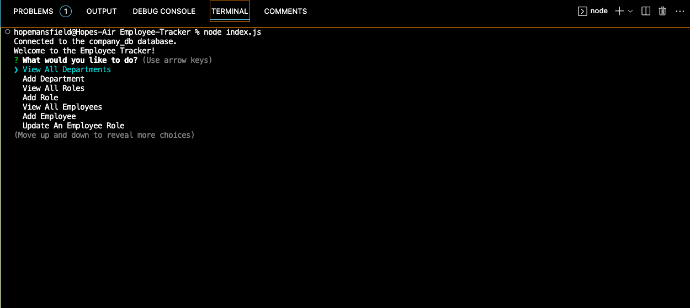
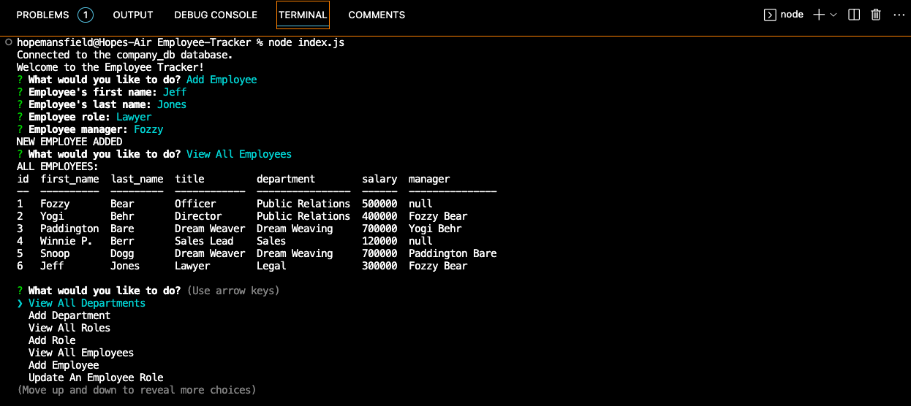

# Employee Tracker

## Description

The Employee Tracker app is a content management system that allows users to keep track of employees in a company database. From the command line, users can view and add departments, roles, and employees, as well as edit existing employees. 

---

## Table of Contents

[Installation](#installation)

[Usage](#usage)

[Contributing](#contributing)

[Questions](#questions)

---

## Installation
    
This app requires npm, node.js, and the express, inquirer v8.2.4, console.table, and mysql2 packages. Use git clone to clone the repo to a local folder. Run npm install from the command line to install the necessary packages.

---
    
## Usage
    
From the command line, run node index.js to initiate this app. Follow each of the prompts from inquirer and enter additional information when prompted.

A video showing a full walk-through of this app's functionality can be viewed [here](https://drive.google.com/file/d/1NoFPyVrD_TztvRBs7N-HNL4If2EBNMAW/view).

---

---

---
    
## Contributing

The repository for this app can be found [here](https://github.com/heyitsthatgirl/Employee-Tracker.git).

For information on how to contribute to a project through forking, please visit the 
GitHub documentation on [Contributing to projects through forking](https://docs.github.com/en/get-started/quickstart/contributing-to-projects).

---

## Questions
    
To ask additional questions about this app, please contact me at hopemansfield@gmail.com.

